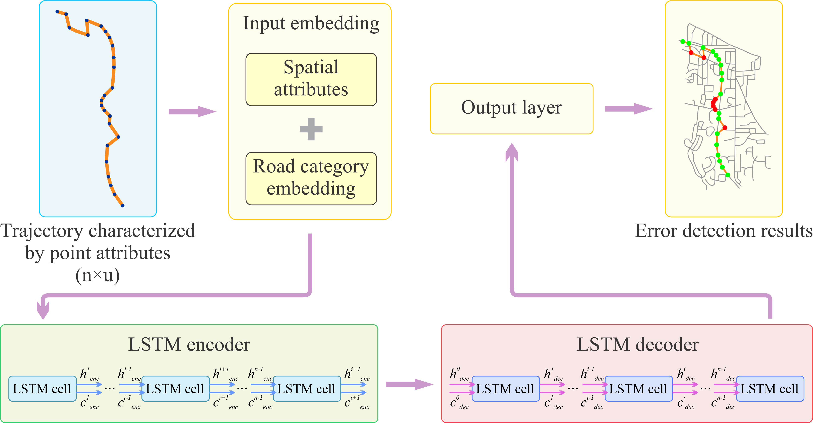

# Medark: A map-matching error detection and rectification framework for vehicle trajectories
Medark is a framework that leverages LSTM to detect map-matching errors in vehicle trajectories and subsequently rectifies these errors to produce trajectories accurately aligned with the road network.

**Citation info:**
> Wan, Z., & Dodge, S. (Provisionally accepted by IJGIS). Medark: A map-matching error detection and rectification framework for vehicle trajectories.

## Abstract
The widespread use of Global Navigation Satellite System (GNSS) trackers has significantly enhanced the availability of vehicle tracking data, providing researchers with critical insights into human mobility. Map matching, a key preprocessing step in movement analysis, matches vehicle tracking data to road segments but often introduces errors that can affect subsequent analyses. Existing map-matching methods, categorized into classic spatially generalizable methods and region-specific deep-learning-based methods, both have limitations. Region-specific deep learning methods, while more accurate, do not transfer well across different geographical regions. Moreover, the temporal adaptability of both approaches---their ability to handle GNSS signals of varying sampling intervals---has not been thoroughly examined. To overcome these limitations, we introduce Medark, a novel framework for detecting and rectifying errors in classic map-matching methods while preserving spatial generalizability. The proposed model is trained using a transfer-learning approach with synthetic trajectories generated in Ann Arbor and Los Angeles at various sampling intervals and a real vehicle trajectory dataset from Ann Arbor. Our experimental results validate the effectiveness of Medark. This framework can be integrated with any map-matching method to improve accuracy and produce high-quality trajectories for further analysis.
